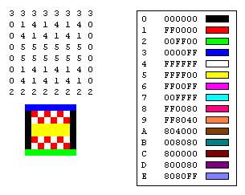

# Image Optimization

## Acknowledgement
When reviewing this section, resources I used or consulted include [blogs on web.dev](https://web.dev/fast/#set-performance-budgets), [Microsoft Dev doc](https://docs.microsoft.com/en-us/windows/win32/gdiplus/-gdiplus-types-of-bitmaps-about), [Google Dev doc](https://developers.google.com/speed/webp), and [this useful source from smashingmagazing](https://www.smashingmagazine.com/2021/09/modern-image-formats-avif-webp/)

For questions that I came across, I also consulted my mentor *Camdyn Rasque*.

## Purpose of Image optimzation
Why should I optimize my images?
When we are shipping code and hitting deadlines, it’s easy to forget about optimizing your images. 
But the truth is, if we don’t optimize our images we are losing money. Web pages with optimized images load faster. 
Faster pages have 
- higher conversion rates, 
- lower bounce rates, and 
- Better user experiences
- smaller images reduce bandwidth costs (the monthly fees for any Content Delivery Network services and other Internet telecommunications charges) for you and your visitors.
## Table of Contents
 - [Terms](#terms)
    - [Lossless and lossy compressions](#lossless-and-lossy-compressions)
    - [Transparency](#transparency)
    - [DPI](#dpi)
 - [Image Optimization (Compression)](#image-optimization-compression)
 - [Image formats](#image-formats)
    - [Bitmap Images](#bitmap-images-raster-images) 
        - [Graphic File formats for saving bitmaps in files](#graphic-file-formats-for-saving-bitmaps-in-files)
        - [Choosing the right Bitwise image formats](#choosing-the-right-image-formats)
    - [Vector Images](#vector-images)
    - [Pictures, sources, img tags](#picture-source-img-tags)
 - [Accessibility](#accessibility)
    - [alt attributes](#alt-attributes)
    - [long desc attributes](#long-desc-attributes)
    - [width/height attributes](#widthheight-attributes)
 - [Project 1](#project-1)
 - [Project 2](#project-2)
 - [Project 3](#project-3)
## Terms
 ### Lossless and lossy compressions
- With lossless compression, every bit of data originally in a file remains after it is uncompressed, and all the information is restored. 
- Lossy compression reduces a file by permanently eliminating certain information, especially redundant information.
### Transparency 
There are 3 major types of transparency:
  - First type - None
     - the bitmap is a rectangle and will obscure every pixel below it
  - Second type - binary
     - either completely transparent or completely opaque
  - Third type - Many bits of transparency (commonly 8)
     - i.e. 256 values from 0-100% for each pixel
     - provide an image that has finer graduations than the human eye can discern### Image Sizes

### RGB component 
1. storing color value itself,
   - RGB component
     - least effective as human eyes can capture more color
     - inefficient for common operations such as brighten
2. transparency of each pixel
   - critical for edge of non-rectangular images
   - each pixel needs to have its level of transparency(opacity) set from 0% to 100%
3. Bitmap metadata
   - information about the image which can range from color table and resolution to the owner of the image

Due to the large amount of byte a bitmap takes up, compression is **the key for a new format to develop**.

### DPI
- DPI stands for Dots Per Inch. This is a term, originally from printing, that refers to how many printed dots there are in one inch of your printed document. It’s now a term used across computing to allow you to determine the quality and resolution of a photo or image.
- The higher the value, the more detailed and sharper your image will be. Images with higher DPI values can also be zoomed in much further before pixelation begins to occur.

## Image Optimization (Compression)
## Image formats:
- Vector graphics use lines, points, and polygons to represent an image.
- Raster graphics represent an image by encoding the individual values of each pixel within a rectangular grid.

However, vector formats fall short when the scene is complicated.

## Bitmap Images (Raster Images)

- A bitmap is an array of bits that specifies the color of each pixel in a rectangular array of pixels. 

    - The number of bits devoted to an individual pixel determines the number of colors that can be assigned to that pixel. 
    - For example, if each pixel is represented by 4 bits, then a given pixel can be assigned one of 16 different colors (2^4 = 16).
    - Disk files that store bitmaps usually contain one or more information blocks that store information such as number of bits per pixel, number of pixels in each row, and number of rows in the array.
    - Such a file might also contain a color table (sometimes called a color palette). A color table maps numbers in the bitmap to specific colors. The following illustration shows an enlarged image along with its bitmap and color table. 
    - Look at the pixel in row 3, column 5 of the image. The corresponding number in the bitmap is 1. The color table tells us that 1 represents the color red, so the pixel is red. All the entries in the top row of the bitmap are 3. The color table tells us that 3 represents blue, so all the pixels in the top row of the image are blue.




 - Each pixel is represented by a 4-bit number, so there are 2^4 = 16 colors in the color table. Each color in the table is represented by a 24-bit number: 8 bits for red, 8 bits for green, and 8 bits for blue. The numbers are shown in hexadecimal (base 16) form: A = 10, B = 11, C = 12, D = 13, E = 14, F = 15.
 - A bitmap that stores indexes into a color table is called a palette-indexed bitmap.
Some bitmaps have no need for a color table. For instance, if a bitmap uses 24 bits per pixel, that bitmap can store the colors themselves rather than indexes into a color table.
 - The following illustration shows a bitmap that stores colors directly (24 bits per pixel) rather than using a color table. The illustration also shows an enlarged view of the corresponding image. In the bitmap, FFFFFF represents white, FF0000 represents red, 00FF00 represents green, and 0000FF represents blue.


## Graphic File formats for saving bitmaps in files.
Windows GDI+ supports the graphics file formats:

- Bitmap (BMP)

    - is a standard format used by Windows to store device-independent and application-independent images. 
    - The number of bits per pixel (1, 4, 8, 15, 24, 32, or 64) for a given BMP file is specified in a file header. 
    - BMP files with 24 bits per pixel are common.

- Graphics Interchange Format (GIF)
    - a common format for images that appear on Web pages. 
    - GIFs work well for line drawings, pictures with blocks of solid color, and pictures with sharp boundaries between colors. 
    - GIFs are compressed, but no information is lost in the compression process; a decompressed image is exactly the same as the original.
    - **One color** in a GIF can be designated as transparent, so that the image will have the background color of any Web page that displays it. 
    - A sequence of GIF images can be stored in a single file to form an animated GIF. 
    - GIFs store at most 8 bits per pixel, so they are limited to 256 colors.
- Joint Photographic Experts Group (JPEG)
    - JPEG is a compression scheme that works well for natural scenes, such as scanned photographs. 
    - Some information is lost in the compression process, but often the loss is imperceptible to the human eye. 
    - Color JPEG images store 24 bits per pixel, so they are capable of displaying more than 16 million colors. 
    - There is also a grayscale JPEG format that stores 8 bits per pixel. 
    - JPEGs do not support transparency or animation.
    -  The level of compression in JPEG images is configurable, but higher compression levels (smaller files) result in more loss of information. 
    - A 20:1 compression ratio often produces an image that the human eye finds difficult to distinguish from the original.
    - The following illustration shows a BMP image and two JPEG images that were compressed from that BMP image. 
    - The first JPEG has a compression ratio of 4:1 and the second JPEG has a compression ratio of about 8:1.
    > Note that JPEG compression does not work well for line drawings, blocks of solid color, and sharp boundaries. 
    
    > The following illustration shows a BMP along with two JPEGs and a GIF. The JPEGs and the GIF were compressed from the BMP. The compression ratio is 4:1 for the GIF, 4:1 for the smaller JPEG, and 8:3 for the larger JPEG. Note that the GIF maintains the sharp boundaries along the lines, but the JPEGs tend to blur the boundaries.
    > 

    > Note that JPEG is a compression scheme, not a file format. JPEG File Interchange Format (JFIF) is a file format commonly used for storing and transferring images that have been compressed according to the JPEG scheme. JFIF files displayed by Web browsers use the .jpg extension.

- Exchangeable Image File (Exif)
    - Exif is a file format used for photographs captured by digital cameras. 
    - An Exif file contains an image that is compressed according to the JPEG specification. 
    - An Exif file also contains information about the photograph (date taken, shutter speed, exposure time, and so on) and information about the camera (manufacturer, model, and so on).
- Portable Network Graphics (PNG)
    - The PNG format retains many of the advantages of the GIF format but also provides capabilities beyond those of GIF. 
    - Like GIF files, PNG files are compressed with no loss of information. 
    - PNG files can store colors with 8, 24, or 48 bits per pixel and gray scales with 1, 2, 4, 8, or 16 bits per pixel. 
    - In contrast, GIF files can use only 1, 2, 4, or 8 bits per pixel. A PNG file can also store an alpha value for each pixel, which specifies the degree to which the color of that pixel is blended with the background color.
    - PNG improves on GIF in its ability to progressively display an image; that is, to display better and better approximations of the image as it arrives over a network connection. 
    - PNG files can contain gamma correction and color correction information so that the images can be accurately rendered on a variety of display devices.

- Tag Image File Format (TIFF)
    - TIFF is a flexible and extendable format that is supported by a wide variety of platforms and image-processing applications. 
    - TIFF files can store images with an arbitrary number of bits per pixel and can employ a variety of compression algorithms. 
    - Several images can be stored in a single, multiple-page TIFF file. 
    - Information related to the image (scanner make, host computer, type of compression, orientation, samples per pixel, and so on) can be stored in the file and arranged through the use of tags. 
    - The TIFF format can be extended as needed by the approval and addition of new tags.

- WebP
    - Superior lossless and lossy compression for images on the web. 
    - Are used to create  smaller, richer images that make the web faster.
    - WebP lossless images are 26% smaller in size compared to PNGs. WebP lossy images are 25-34% smaller than comparable JPEG images at equivalent SSIM quality index.
    - Lossy WebP compression uses predictive coding to encode an image, the same method used by the VP8 video codec to compress keyframes in videos. Predictive coding uses the values in neighboring blocks of pixels to predict the values in a block, and then encodes only the difference.
    - Lossless WebP compression uses already seen image fragments in order to exactly reconstruct new pixels. It can also use a local palette if no interesting match is found.
- AVIF 
    - AVIF is a solid first choice if lossy, low-fidelity compression is acceptable and saving bandwidth is the number one priority. Assuming encode/decode speeds meet your needs.
    - AVIF supports very efficient lossy and lossless compression to produce high-quality images after compression
    - Some tests have shown that AVIF offers a 50% saving in file size compared to JPEG with similar perceptual quality.
    - AVIF supports animations, live photos, and more through multilayer images stored in image sequences.
    

## Choosing the right Bitwise image formats
In addition to different lossy and lossless compression algorithms, different image formats support different features such as animation and transparency (alpha) channels. 
As a result, the choice of the "right format" for a particular image is a combination of desired visual results and functional requirements.


| Format | Transparency | Animation | Lossless/Lossy   | Progressive Rendering | Compression | Supported by all major Browser |
| ------ | ------------ | --------- | ---------------- | --------------------- | ----------- | ------------------------------ |
| AVIF   | Yes          | Yes       | Lossless         | No                    | excellent   | No                             |
| WebP   | Yes          | Yes       | Lossy & Lossless | No                    | excellent   | No                             |
| JPEG   | No           | No        | Lossy            | Yes                   | good        | Yes                            |
| PNG    | Yes          | No        | Lossless         | interlaced            | ok          | Yes                            |
| GIF    | Yes          | Yes       | Lossless         | interlaced            | ok          | Yes                            |

## Vector Images
- More specifically, a vector graphic is an artwork made up of points, lines, and curves that are based upon mathematical equations, rather than solid colored square pixels.
- Vector files uses vector data with specific magnitude and direction to draw on screen
- Best use cases: logo, diagram, animated elements, charts, and graphs
- Worst use cases: photo
- The most popular used file format would be SVG (Scalable Vector Graphic), with the occasional usage of PDF files having vector graphics.

### Pros of Vector Images: 
- text in vector images remains accessible
- with SVG, can easily styling and scripting, because each component of the image is an element that can be styled via CSS or scripted via JS
### Cons of Vector Images:
- can get complicated quickly
- complex SVGs can take significant processing time
- can be harder to create

### **Implementations of SVG:**
SVG is an XML based language so it's both searchable and indexable
### Adding SVG using `````` element 
Pros:
- quick, can be made into hyperlink
- can be cached by the browser

cons:
- can't manipulate the image with js
- must use inline css, external stylesheet doesn't work on the file
- can't restyle with css pseudoclasses

### Add SVG embed into HTML, wrap in ```<svg>``` element
pros:
- Saves http request which reduce loading time
- Can assign attributes to the element
- Can be made into hyperlink

Cons:
- Can only be placed in one place
- Increase size of the HTML file
- Can't cache inline SVG
## ```<Picture>, <source>, ``` tags
Before:
```HTML

```
After:
```html
<picture>
  <source type="image/webp" srcset="flower.webp">
  <source type="image/jpeg" srcset="flower.jpg">
  
</picture>
```
Tags:
1) The ```<picture>``` tag
The ```<picture>``` tag provides a wrapper for zero or more (>= S```<source>``` tags and one `````` tag.

2) The `````` tag is what makes this code work on browsers that don't support the ```<picture>``` tag. If a browser does not support the ```<picture>``` tag, it will ignore the tags it doesn't support. Thus, it only "sees" the `````` tag and loads that image.

    - Note: (The  tag should always be included, and it should always be listed last, after all <source> tags. - The resource specified by the  tag should be in a universally supported format (e.g. JPEG), so it can be used as a fallback.

3) The ```<source>``` tag specifies a media resource.
The browser uses the first listed source in a format it supports.
If the browser does not support any of the formats listed in the ```<source>``` tag, it falls back to loading the images specified by the `````` tag.

    - The <source> tag for the "preferred" image format (in this case that is WebP) should be listed first, before other <source> tags. 
    - The value of the type attribute should be the MIME type corresponding to the image format. An image's MIME type and its file extension are often similar, but they aren't necessarily the same thing (e.g. .jpg vs. image/jpeg).
## Accessibility

### alt attributes

### long desc attributes
### width/height attributes

## Project 1
The purpose of project 1 is to see the differences between different image formats.

In this project, we will start with our quality evaluation of JPEG, WebP, and AVIF using the default high-quality output settings of Squoosh for each format

Intentionally untuned to mimic a new user's experience with them.

As a reminder, you should aim to evaluate the quality configuration and formats that best suit your needs. 

In this first test, encoding a 560KB photo of a sunset (with many textures) produces an image that is visually and perceptually quite similar for each. The output comes in at 289KB (JPEG@q75), 206KB (WebP@q75), and 101KB (AVIF@q30) — up to 81% in compression savings.


## Project 2

For a more extreme example of the differences between JPEG and AVIF, we can look at an example from the Kodak dataset (evaluated by Netflix) comparing a JPEG (4:4:4) at 20KB to an AVIF (4:4:4) at 19.8KB. 

Notice how the JPEG has visible blocky artifacts in the sky and roof. The AVIF is visibly better, containing fewer blocking artifacts. There is, however, a level of texture loss on the roof and some blurriness. It’s still quite impressive, given the overall compression factor is 59x.


## Project 3
Next, let’s evaluate the quality of a beach image with many fine details, textures, and areas of low contrast in the clouds. We will compare the original (at 482KB) to what JPEG, WebP, and AVIF can produce with a 45KB file-size limit (with no advanced tuning) — using Squoosh; this works out at JPEG (MozJPEG) at 50% quality, WebP at 54%, and AVIF at 36%.


